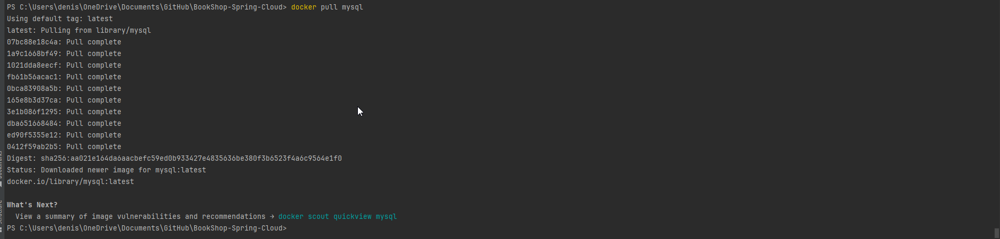

# BookShop

<p align="center">
  <sub>Project made by <a href="https://github.com/denisapredescu"><i>Denisa Predescu</i></a> and <a href="https://github.com/postolache-andreea-miruna"><i>Andreea Miruna Postolache</i></a> for AWBD course, gr 405, 2nd Semester of 1st Year of Databases and Software Tehnologies Master Domain at University of Bucharest, 2024
  </sub>
</p>

<details><summary>Project requirements</summary>


</details>

---

<p><strong>The current project is a microservice that contains and has linked multiple concepts from RestAPI in Spring Cloud Architecture presenting below.   
</strong></p>

---

<h2>Spring Cloud Config Server</h2>

Links and descriptions of projects:

- <p id="config-file">Link to GitHub configuration files project (push data to be collected by config server and then used in main project): <a href="https://github.com/postolache-andreea-miruna/configuration_files">Click here</a></p>

<details><summary>Present all the config files properties</summary>

<p align="center">
  
</p>

</details>

<details><summary>Example of config file - general sales off</summary>

<p align="center">
  
</p>

</details>

- Link to spring cloud configuration server (get the data from configuration files): <a href="https://github.com/postolache-andreea-miruna/config-server">Click here</a>

<details><summary>Picture configuration server properties file</summary>

<p align="center">
  
</p>

</details>

- <p id="sales-off">Link to GitHub microservices project (the data collected by the config-server is here taken by the microservices): <a href="https://github.com/postolache-andreea-miruna/salesOff">Click here</a>
</p>

This microservice is called `Sales Off` and store the discounts from bookshop application.

---

<h2>Feign Rest Client</h2>

The Feign Rest Client is created in the current project.

<details><summary>Picture of Feign Client interface</summary>

<p align="center">
  
</p>

</details>

<details><summary>Picture of enabling Feign Client for microservice communication</summary>

The code is made in BookShopSpringCloudApplication (project application file). Feign scope is to create a link between [Sales Off Microservice](#sales-off) 
and current main project. With Feign Client Interface method, we can get the information from `Sales Off Microservice` aka the data stored initially in [configuration file](#config-file).   

<p align="center">
  
</p>

</details>

<details><summary>Example of usage of the data received with Feign Client</summary>

The interface SalesOffServiceProxy is used in Basket Service in `sendingOrder` method:

<p align="center">
  
</p>

</details>

---
<h2 id="eureka">Eureka</h2>

Link to GitHub project: <a href="https://github.com/postolache-andreea-miruna/server_eureka">Click here</a>

<details><summary>EnableEurekaServer annotation </summary>

By adding `EnableEurekaServer` annotation in Eureka Server Project, we can visualize the links made with Eureka in our project.

<p align="center">
  
</p>

</details>


<details><summary>Accessing Spring Eureka Web Page</summary>

For accessing the page, use the port `8761`:
```agsl
http://localhost:8761/
```

<p align="center">
  
</p>

</details>


### Connections
- In [Configuration Files Properties](#config-file) connection with eureka
<p align="center">
  
</p>

- In [Eureka Server](#eureka) connection with config server to be able to get the data 
<p align="center">
  
</p>

-  [Configuration Files Properties](#config-file) connection with eureka for the [Bookshop Client](#bookshop)
<p align="center">
  
</p>

-  [Microservice project - Sales Off](#sales-off): enable access to the default implementation of the discovery client - Eureka with the annotation `@EnableDiscoveryClient`
<p align="center">
  
</p>


---
<h2>Cloud Load Balancer</h2>

Link to Spring Cloud Gateway GitHub project called Gateway: <a href="https://github.com/postolache-andreea-miruna/gateway">Click here</a>

<details><summary>Present the application properties in which the connection with configuration server and Eureka is made</summary>

<p align="center">
  
</p>

</details>


### Add a new properties file in [Configuration Files](#config-file) that makes the connection between Eureka and Gateway project
<details><summary>Present the new file `gatewayserverbookshop.properties`</summary>

<p align="center">
  
</p>

</details>

### Route Locater

The `RouteLocator` handles all the request that have a specific prefix: <strong>bookshop</strong>

<details><summary>Present code</summary>

<p align="center">
  
</p>

</details>

### Routes

- For accessing the actuator, use the link:
```agsl
http://localhost:8071/actuator/gateway/routes
```
<details><summary>Present the response from route</summary>

<p align="center">
  
</p>

</details>


- For getting the information from books and all the routes that can be used for a given book (delete/save/update), use the link:
```agsl
 http://localhost:8071/bookshop/BookShop-Spring-Cloud/book/allBooks
```
<details><summary>Present the response from route</summary>

<p align="center">
  
</p>

</details>


- For accessing the data for discounts (salesOff), use the link:
```agsl
http://localhost:8071/bookshop/salesOff/salesOff
```

<details><summary>Present the response from route</summary>

<p align="center">
  
</p>

</details>

### Filters
1. **LogTraceFilter filter**: this filter adds the correlation id to any request that is called. The correlation id is an 
identifier that is important for tracking with Zipkin.

    <details><summary>Present code</summary>
    
    <p align="center">
      
    </p>
    
    </details>
   
2. **ResponseFilter filter**: his filter adds the correlation id to the response any request that is called.

    <details><summary>Present code</summary>

    <p align="center">
      
    </p>

    </details>

### Accepting correlation id in projects
- in [Sales Off Microservice](#sales-off) - modified the `getSalesOff` method from `SalesOffController` controller
   <details><summary>Present code</summary>
    <p align="center">
      
    </p>
    </details>
- in current (main) project:
  1. in `SalesOffServiceProxy` interface
        <details><summary>Present code</summary>
        <p align="center">
          
        </p>
        </details>
  
  2. in `BasketController` controller (here is used the Microservice Sales Off
        <details><summary>Present code</summary>
        <p align="center">
          
        </p>
        </details>
---

<h2>Zipkin</h2>

<details><summary>Installation</summary>

From the [official page](https://zipkin.io/pages/quickstart) the easiest way to install Zipkin is by Docker command:
```agsl
docker run -d -p 9411:9411 openzipkin/zipkin
```
<p align="center"> 

</p>
</details>

<details><summary>Steps to run Zipkin</summary>

1. Install and start RabbitMQ
2. Run the Docker container that contains the Zipkin image
3. Run the Zipkin with this link:
```agsl
http://127.0.0.1:9411/zipkin/
```
<p align="center"> 

</p>
</details>

---
<h2>Resilience4j</h2>

`Resilience4j` is used to avoid errors/issues when the microservice being called or the method called from that microservice
does not work. CircuitBreaker is used to avoid cascading failure, and fallback methods are created.

<details><summary>CircuitBreaker annotation</summary>

<p align="center">
  
</p>

</details>

<details><summary>Fallback method</summary>

<p align="center">
  
</p>

</details>

---

<h2>Docker</h2>

First add and run a maven configuration that clean and install the project
```agsl
clean install -Dmaven.test.skip=true
```

To run Docker from the Spring Java Application you need first to download the Docker Desktop from this link: https://docs.docker.com/desktop/ (x86_64 version). Then create an account and login in the application.

In Spring Application create a Dockerfile following the steps: File -> New -> Dockerfile

Insert this code in the Dockerfile:

    FROM openjdk:latest
    ARG JAR_FILE=target/*.jar
    COPY ${JAR_FILE} app.jar


Open a terminal and make the connection with your Docker account:
```agsl
docker login
```
Then insert the username (from parantheses) and the password.
<p align="center">
  
</p>

Create an image:
```agsl
docker build -t bookshop . 
```
<p align="center">
  
</p>

See if the image is created:
```agsl
docker images
```
<p align="center">
  
</p>

Create mysql image:
```agsl
docker pull mysql 
```
<p align="center">
  
</p>

Create a network for docker environment
```agsl
docker network create boot-mysql
```
<p align="center">
  
</p>

Create mysql container
```agsl
docker run --name bookshop_mysql_container --network boot-mysql -e MYSQL_ROOT_PASSWORD=root -e MYSQL_DATABASE=bookshopspringcloud -e MYSQL_PASSWORD=root  mysql 
```
<p align="center">
  
</p>

Now that we have the mysql container, we need to make some changes to the resource so it will run on localhost and in docker environment also.
Create a new resource named `application-sqldocker.properties`:

```agsl
spring.datasource.url=jdbc:mysql://bookshop_mysql_container:3306/bookshopspringcloud
spring.datasource.username=root
spring.datasource.password=root

spring.jpa.hibernate.ddl-auto=create-drop
spring.sql.init.mode = never
spring.sql.init.platform=mysql
```

Run the clean - install configuration then open a new and insert the following command:

    docker run -e "SPRING_PROFILES_ACTIVE=sqldocker" --name bookshop_mysql_docker --network boot-mysql -p 8001:8000 bookshop


<details><summary>
<strong>Verification existing images and containers</strong>
</summary>
<p align="center">
  
</p>

<p align="center">
  
</p>

<p align="center">
  
</p>
</details>


---
<h2>Swagger</h2>

<details><summary>Swagger images</summary>
Run the project to automatically open the swagger in browser

<p align="center">
  
</p>

<p align="center">
  
</p>

</details>

<details><summary>Example function in code and swagger</summary>

1. <details><summary>See code</summary>

    <p align="center">
      
    </p>
    
    </details>

2. <details><summary>See method in swagger</summary>

    <p align="center">
      
    </p>
    
    </details>

</details>

---
## Error handling
When the user has no books in the basket and he/she click on sent button aka run the `sendingOrder` method 
the `NoFoundElementException` is caught and a custom error will be thrown as a response. The response contains the 
status, the error title and the error message.
- Custom Error Handling
<p align="center">
    
</p>

- Throw exception in BasketService
<p align="center">
    
</p>

- See exception in swagger
<p align="center">
    
</p>

---
## HATEOS links
HATEOAS links helps in observing the possibilities that can be achieved with the elements already entered 
in the required fields.

<p align="center">
    
</p>

